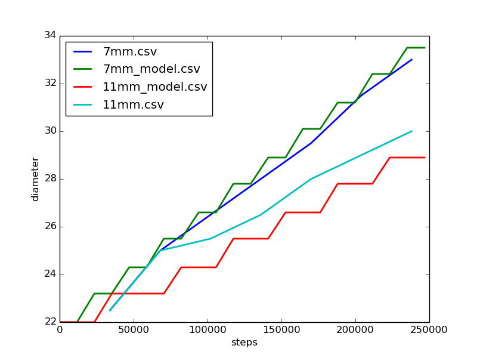

# Modelling spindle radius

with the large drawbot, the spindle radius changes as the string wraps.
Do we have to measure this or can we model it?

Short answer: maybe.

# Measurements

Using 2 spindle widths of 7 and 11mm, I recorded the rough splindle diameter into [7mm.csv](7mm.csv) and [11mm.csv](11mm.csv). The spindles were wound 32000 steps for each measurement (roughly one meter of string).

# Model

Then a [dirty python](model.py) script was used to make a model of how spindle diameter changes as a function of turns. This is used to create 2 new csv files.

# Plot

All 4 csv files are plotted using [plot.py](plot.py) which depends on matplotlib . 
Use [show.sh](show.sh) to create the modelled data and then plot all files on the same graph.

    ./show.sh
   
